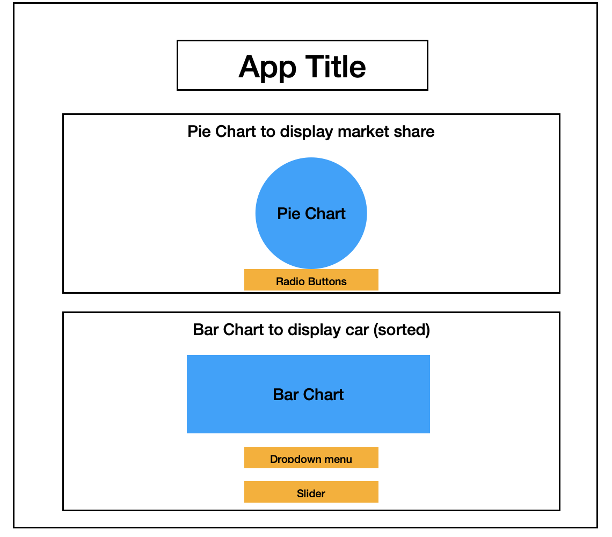

# CarMarketStats - Proposal

App is running at: https://car-market-share-dash.onrender.com

## Motivation and Purpose

Choosing a car that fits one's needs and budget can be an exhaustive task due to the abundance of options available in the market. To make a better decision, it is essential to have a fundamental understanding of the current market share of some popular car brands, as well as the prices and features of the models that suit one's needs. However, obtaining this information can be time-consuming and overwhelming, especially for those who are not familiar with the automotive industry.

This is where our app comes in. **We design this app to help people navigate the car market and make informed decisions.** Our app provides a user-friendly interface that displays the market share of popular car brands and models, as well as rankings based on other factors such as price and fuel efficiency. By using our app, users can quickly get a sense of the current car market and make informed decisions when selecting a car that fits their needs. Our target audience is people who want to obtain a fundamental understanding of the current car market but do not know where to start, and we hope you enjoy using this CarMarketStats app.

## Description of Data

This dashboard utilizes the `Car Sales` dataset, which can be found on Kaggle at: https://www.kaggle.com/datasets/gagandeep16/car-sales. The original dataset contains information on 157 different car models, including sales value, vehicle type, and engine size. For simplicity, we have chosen to focus on only four columns for analysis and demonstration purposes: `Manufacturer`, `Model`, `Sales_in_thousands`, `Price_in_thousands`, and `Fuel_efficiency`. We have removed rows with missing values for analysis.

We offer analyses at different levels, including `Manufacturer` and `Model`, in order to make our app more comprehensive. As a result, you may notice that we have aggregated data using both `Manufacturer` and `Model`. Additionally, we have sorted the cars based on the remaining three columns, providing users with the necessary information to make informed decisions when selecting their next vehicle.

## Research Questions and Usage Scenarios

### Research Questions

As previously mentioned, our aim with this app is to provide individuals who are interested in gaining a fundamental understanding of the current car market but may not know where to begin, with the necessary information. To achieve this goal, we will focus on the following research questions in the development of our dashboard:

1. Which features do our users find most helpful?
2. Which group of people (in terms of education level, industry, profession) are most likely to find this app useful?
3. How can we further minimize the effort required from our users when using this app?

### Usage Scenarios

Michelle, a recent graduate from UBC, is looking to purchase her first car but is overwhelmed by the many available choices and doesn't know where to begin. Additionally, she has no information on what price range she should be considering.

To address these challenges and concerns, Michelle is looking for a source of information that provides statistics on sales and prices of popular brands such as Toyota and Ford, as she believes their popularity must be based on some reasons. Her main consideration is price, as her budget is not unlimited.

After searching online, Michelle discovered CarMarketStats, an App which she found to be a great starting point. By using this app, Michelle was able to gain a basic understanding of the current market share of each car brand, as well as which models are more popular than others. Having explored the app, Michelle now has a better understanding of the most popular options on the market and is ready to reach out to dealers who offer these cars.

### App Sketch

